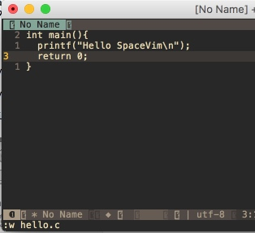

# 基本使用

之所以叫SpaceVim，就是因为很多快捷键是空格键<space>作为第一个键。

# 0. 感受空格键

打开MacVim，按下空格键，1秒后下方会出现一个提示窗口。


如果要关闭这个窗口，可以按`ESC`。

现在试试输入`空格键 字母f 字母t`（以后简称 SPC f t），可以关闭右侧的文件浏览器，再次输入`SPC f t`可以再打开。

# 1. 开始输入


打开MacVim（以后简称vim）后，有两个提示选项`e`和`q`。按下`e`会打开一个空的编辑器，按下`q`则退出vim。

现在输入`e`，然后输入一段程序：

```
int main(){
    printf("Hello SpaceVim\n");
    return 0;
}
```

输入`:w hello.c`保存。




# 2. 打开文件

重新打开vim，如果此时我们想打开一个文件，例如打开HOME目录下的hello.c文件，输入`:e hello.c`。（这都是vim基本的使用方式）


打开后如图：


# 3. 文件浏览器


现在再回到右侧的文件浏览器上，试试按下`<F3>`也可以打开关闭。也就是 `<F3>` 或者 `SPC f t`都可以打开关闭文件浏览器。

打开文件浏览器后，光标会进入文件浏览器中，这时可以输入`j`、`k`上下移动，`h`和`l`可以打开关闭文件夹。

例如下图：按`j`移动到`hello.c`后，按回车或字母`l`都可以打开`hello.c`文件。


# 3. 缓冲区管理

vim中打开的每个文件都可称为一个缓冲区（buffer），如果我们打开了多个文件，可以`SPC b b`显示列表：


此时可以输入文件名过滤，例如输入`append`，然后回车，可以切换到`append.c`的文件。

此外，这个节目还可以通过`ctrl+n`或`ctrl+p`来上下移动选择文件。

如果要当前缓冲区，可以使用`SPC b d`。


# 5. 窗口管理

输入`SPC w /`可在`右侧分割窗口`，输入`SPC w -`可在下方分割窗口。分隔完窗口后，光标会落到文件浏览器，此时可以通过文件浏览器选择某个文件打开文件。在选中文件回车后，会提示将文件放入哪个窗口中。如下图：

此时输入`a`（不需要大写），就可以把文件放入A窗口。

有了多个窗口，那如何切换呢？仔细看可以注意到`窗口左下角有编号`，


如果要切换到窗口1，则输入`SPC 1`即可切换过去。切换到窗口2则输入`SPC 2`，以此类推。这点可以说是相当方便了。

还可以使用`SPC w TAB`（TAB表示Tab键）顺序切换窗口。

# 6. Tab管理

打开的文件多了，还可以使用Tab。现在输入`SPC w F`（注意是大写F），可以新建一个Tab页面。然后输入`SPC t t`显示Tab列表：


在Tab中可以上下选择（`j`、`k`移动光标）然后回车切换。

也可以使用`SPC w o`顺序切换Tab。


# 总结

SpaceVim中的快捷键都容易记忆，窗口（window）就是w，文件（file）就是f，缓冲区（buffer）就是b，Tab管理就是t。再加上按SPC键后，每个功能都有字母提示，几乎不用再去找某个功能的文档。

