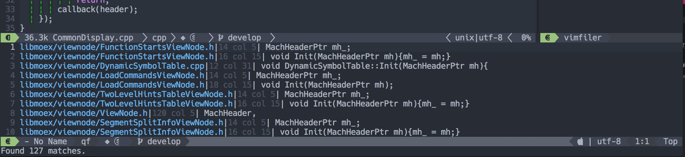

# 工程管理

工程的定义：
SpaceVim会从当前文件自动向上查找`.git`目录或者`.projections.json`文件的目录作为根目录。

输入`SPC p`可以看到支持的功能。

# 模糊查找

最常用的功能就是模糊查找了，`SPC p /`输入任意字符串后回车

在这个窗口中可以按`jk`上下选择，可以按`q`退出。

# git使用

`SPC g s` 查看状态

`SPC g A` 添加所有文件
`SPC g S` 添加当前文件

`SPC g c` 设置commit message，最后 :wq 表示完成并commit

`SPC g p` 开始push

成功后会有提示：

