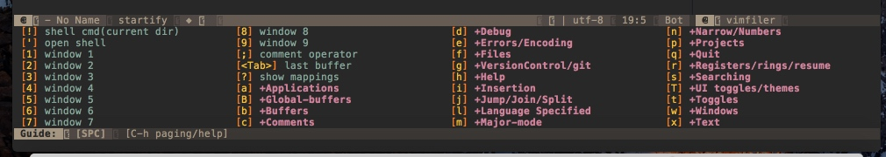

# 感受空格键

打开MacVim，按下空格键，1秒后下方会出现一个提示窗口。

如果要关闭这个窗口，可以按`ESC`。

现在试试输入`空格键 字母f 字母t`（以后简称 SPC f t），可以关闭右侧的文件浏览器，再次输入`SPC f t`可以再打开。

> 备注：上面的截图中存在？的问题，是制作此教程时，没有配置字体的原因。如果安装后配置了字体，不会存在显示？的情况。配置字体请见“安装->字体配置"。

