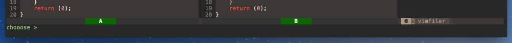
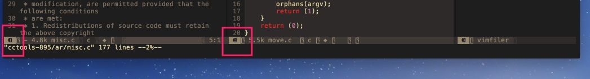

# 窗口管理

输入`SPC w /`可在`右侧分割窗口`，输入`SPC w -`可在下方分割窗口。分隔完窗口后，光标会落到文件浏览器，此时可以通过文件浏览器选择某个文件打开文件。在选中文件回车后，会提示将文件放入哪个窗口中。如下图：

此时输入`a`（不需要大写），就可以把文件放入A窗口。

有了多个窗口，那如何切换呢？仔细看可以注意到`窗口左下角有编号`，

如果要切换到窗口1，则输入`SPC 1`即可切换过去。切换到窗口2则输入`SPC 2`，以此类推。这点可以说是相当方便了。

还可以使用`SPC w TAB`（TAB表示Tab键）顺序切换窗口。

