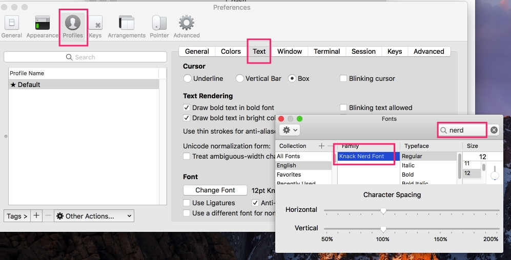

# 字体配置

如果仔细看，可能会发现安装后有些显示问号（？）的地方，这是因为还需要配置一些字体。

这里字体我们使用 https://github.com/ryanoasis/nerd-fonts

可以这样安装：

```
brew tap caskroom/fonts
brew cask install font-hack-nerd-font
```

对于MacVim，安装后在配置文件中加入：

```
let g:spacevim_guifont='Knack\ Nerd\ Font:h12'
```

Terminal.app需要单独配置字体：


iTerm2.app也需要单独配置字体：




