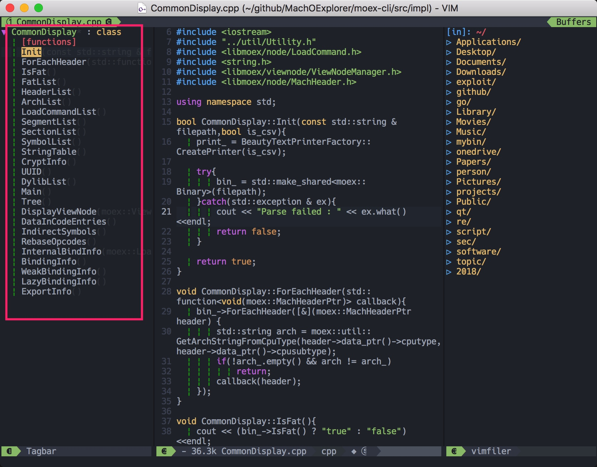

# TagBar

需要先安装ctags，macOS下可以如下安装：

```
brew install ctags
```

安装后可以如下看下是否安装成功：

```
[everettjf@e ~ ]$ ctags --version
Exuberant Ctags 5.8, Copyright (C) 1996-2009 Darren Hiebert
  Compiled: Sep 17 2017, 20:48:43
  Addresses: <dhiebert@users.sourceforge.net>, http://ctags.sourceforge.net
  Optional compiled features: +wildcards, +regex
```

然后打开一个cpp文件（或者其他源代码文件），按`F2`就可以在左侧看到TagBar啦。


可以`SPC 1`移动到TagBar的窗口，选择后回车就可以跳转到对应的函数（方法）。

