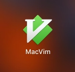

# 安装MacVim

安装的方式有很多，这次我们使用Homebrew来安装。

先安装Homebrew，打开Terminal.app，输入：

```
/usr/bin/ruby -e "$(curl -fsSL https://raw.githubusercontent.com/Homebrew/install/master/install)"
```

回车后，会提示输入密码，输入密码后，等待安装完成。

然后，安装MacVim。

```
brew install macvim
brew linkapps
```
（每行表示一次回车）

安装完成后，可以在LaunchPad看到MacVim了。


