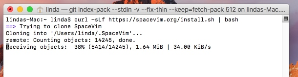
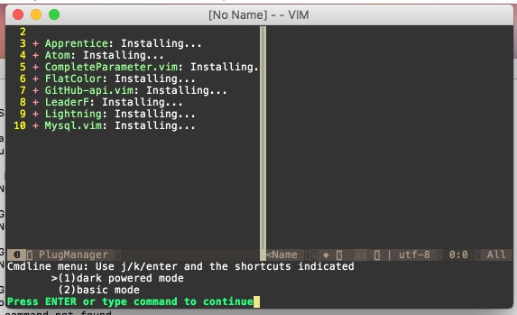
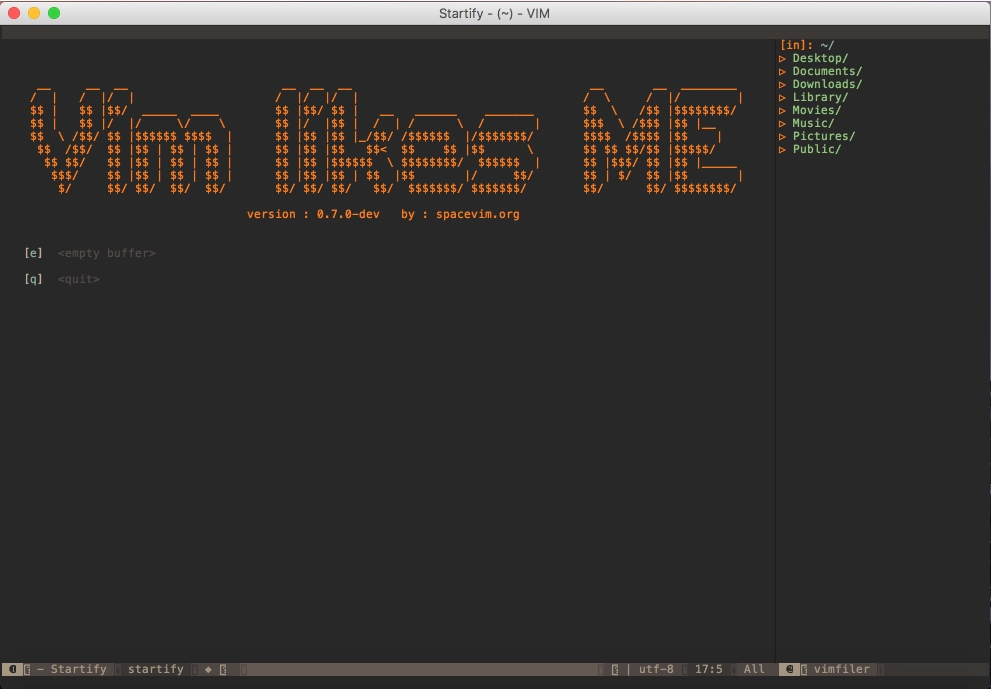

# 安装SpaceVim

打开Terminal.app

```
curl -sLf https://spacevim.org/install.sh | bash
```



完成后运行MacVim.app



首次打开会提示选择一个模式，按键盘”1“选择第一个模式。然后，VIM会安装很多插件，等待安装完成。我这等了16分钟（986秒）安装完成。


好了，退出MacVim，再次打开（再次打开可能有一些VIM插件更新），这次会更新插件，等待更新完成。（有些插件可能更新失败，目前先忽略，不影响当前教程的内容，如果需要的时候再去解决）


好了，完成。




